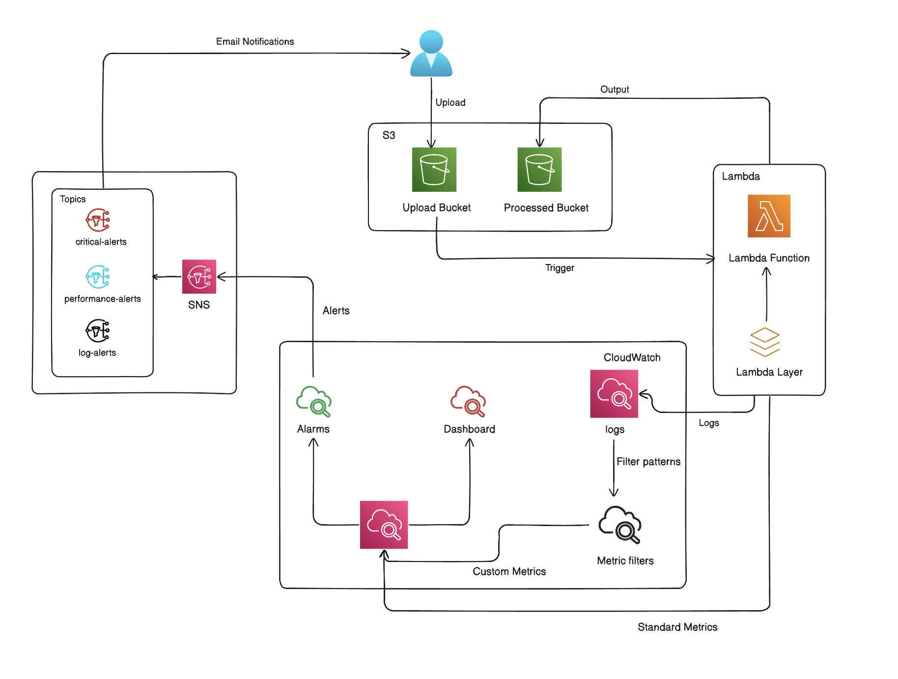

# AWS Lambda Image Processing Pipeline

## 📦 Overview
The system creates a serverless image processing pipeline using AWS and Terraform.

When an image is uploaded to S3, it is automatically processed by a Lambda function and saved to another bucket. Monitoring and alerts are handled using CloudWatch and SNS.

## 🏗️ Architecture
<p align="center">
  
</p>

## ⚙️ Workflow
- Upload an image to the S3 upload bucket  
- S3 triggers the Lambda function  
- Lambda processes the image (using a layer for dependencies)  
- Processed image is saved in the processed bucket  
- Logs are sent to CloudWatch  
- Metrics and alarms are created from logs  
- Alerts are sent via SNS (email)  

## 🧩 Services Used
- **S3** – Store input and output images  
- **Lambda** – Process images  
- **Lambda Layer** – Handle dependencies  
- **CloudWatch** – Logs, metrics, alarms  
- **SNS** – Send notifications  

## 📈 Monitoring
- Tracks Lambda execution (invocations, errors, duration)  
- Uses log-based metric filters for deeper insights  
- Alarms trigger when thresholds are crossed  
- Notifications sent through SNS  

## 🚀 Deployment
```bash
terraform init
terraform apply
```
## 🧪 Testing

- Upload an image to the upload bucket
- Check processed bucket for output
- Verify logs in CloudWatch

## 📊 Results

- Images are processed automatically on upload, with an average execution time of around 2–3 seconds
- The pipeline operates reliably during testing, with consistent end-to-end execution
- CloudWatch logs provide clear visibility into each processing step for monitoring and debugging
- Alerts are triggered in near real time through SNS when errors or performance issues occur

## 🧹 Cleanup

```bash
terraform destroy
```
